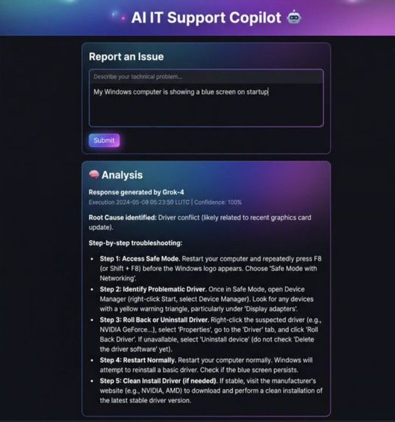

# AI IT Support Copilot

This project is an AI-powered IT support assistant that helps diagnose and resolve technical issues.

## Features
- Root cause analysis
- Step-by-step troubleshooting
- Command suggestions
- Multi-category support (Windows, Network, M365, Security)

## Tech Stack
- Python
- Streamlit
- OpenAI API (via OpenRouter)

## Use Case
Designed to simulate real service desk workflows and reduce resolution time for IT engineers.
## How to deploy 
Please download the repo and add your OpenAI API key to your .env file 
After that, open your command prompt, navigate to the project folder, and run the following command: streamlit run app.py
Your companion will be initialized on your localhost.

## DEMO 

